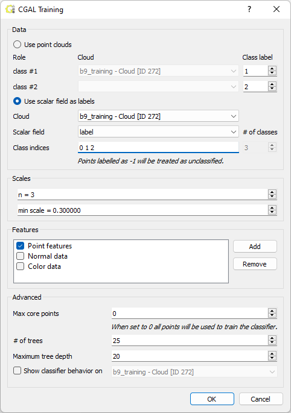
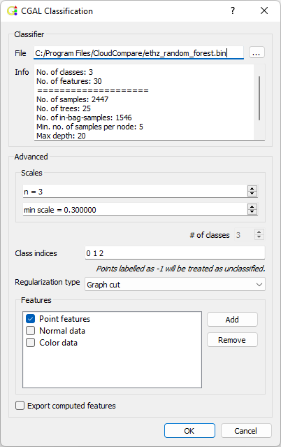
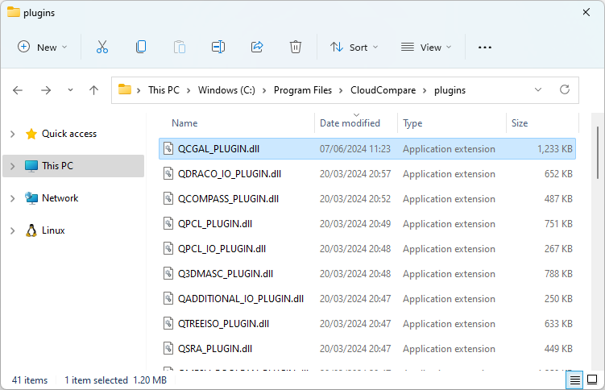

This plugin offers an efficient and fast point cloud classifier for CloudCompare.

Specifically, it incorporates some functionality of the CGAL Classification package into CloudCompare. This is particularly for oriented point clouds (where the z-axis represents the up direction).

Description
===========

The plugin incorporates a classification algorithm for labelling point clouds of urban scenes [[1]](#1). The method is also suitable for other types of terrestrial laser scan. Details about the implementation of this method can be found in the [CGAL project's documentation](https://doc.cgal.org/latest/Classification).

Train classifier
----------------


**Input data**

The classifier works only with point clouds. It is possible to provide either two point clouds (each representing a respective class) like CANUPO, or a single point cloud that possesses a scalar field of labels.

For scalar field input, examplar data is available from the CGAL Github page, download [b9_training.ply](https://github.com/CGAL/cgal/blob/master/Data/data/points_3). When importing the data into CloudCompare, add the `labels` property to the scalar fields section (CloudCompare does not automatically include properties of integer type). The class indicies should be a set of continuous integer values starting from 0 (or -1), where -1 is reserved for unlabelled points. Examples of class indices:
* `class_indices=-1 0 1 2 3` good
* `class_indices=-1 1 2 3` bad
* `class_indices=0 1 2 3` good
* `class_indices=1 2 3` bad

**Tip** if your training data consists of multiple point clouds, the input data can be adapted as follows: First, translate the point clouds on the plane of the z-axis such that there is some gaps/margin between them; then, merge the clouds.

**Scales**

Typically LiDAR data is captured such that one unit of distance in the point cloud corresponds to one meter of distance in the real world.

For generated `point features`, `n` specifies the number of scales used to compute each feature. Scales are a multiplies of `scale = min_scale * i, for i=1,...,n`. Intuitively, some features may be scale dependent, e.g. corners and edges -- appearing at different scales.

**Features**

In the simplest case you will want to use the 'Point features' option to generate some features that have found to be useful [[1]](#1). When selected, 'Point features' computes the following features:

* `Distance_to_plane` measures how far away a point is from a locally estimated plane;
* `Eigenvalue` measures one of the three local eigenvalues;
* `Elevation` computes the local distance to an estimation of the ground;
* `Height_above` computes the distance between the local highest point and the point;
* `Height_below` computes the distance between the point and the local lowest point;
* `Vertical_dispersion` computes how noisy the point set is on a local Z-cylinder;
* `Vertical_range` computes the distance between the local highest and lowest points;
* `Verticality` compares the local normal vector to the vertical vector.

These descriptions are quoted directly from the [CGAL project's documentation](https://doc.cgal.org/latest/Classification), which has additional useful information. For individuals familiar with code, the implementation of these features is available from [CGAL's Github project](https://github.com/CGAL/cgal/tree/master/Classification/include/CGAL/Classification/Feature).

Additional features can be selected for training:
* Normal data
* Color data
* Any scalar field associated with the point cloud

Depending on your input data, some options may or may not appear to be avaliable. To use 'Normal data', make sure to compute the normals in Cloud Compare first.

**Advanced**

Max core points is the number of points sampled to train the classifier. For very large point clouds this may reduce the training time.

The plugin uses a random forest classifier, the `# of trees` and `maximum tree depth` are parameters that affect the quality of the classifier. Increasing the `# of trees` will improve classification quality by averaging the result of multiple decsision trees; however, the method will become slower and consume more memory. Increasing the `maximum tree depth` will allow the classifier to capture more complex patterns; however, this may lead to overfitting.

`Show classifier behavior on` allows you to quickly see the result of the trained classifier on some test data. It is essentially equivalent to running the Classify program manually. *Note:* the point cloud used for testing should be different from the input data used for training as the predicitions on the training data are likely not to be representative of results on other point clouds.

Classify
--------


To classifiy a point cloud, you must have already trained a classifier. If the option to perform classification is grayed out in the menus, make sure to select a point cloud in the DB Tree first.

**Classifier**

After training a classifier on a point cloud, you will have been asked to save a `.bin` file that contains information about the classifier. By default, the last used classifier is selected. To choose a different one, click on the ellipses (`...`) and locate the classifier you want to use. **Warning** invalid `.bin` files may cause the plugin to crash or hang.


**Advanced**

The scales parameters are functionally the same as for training the classifier. *Note:* it is important that the `n` and `min scale` parameters are the same as those used during training.

The class indices parameter is the same as for training the classifier. *Note:* it is important that the `class indicies` parameter is the same as when used during training.

`Regularization type` can be used to improve the raw predictions of the classifier. `None` will skip regularization entirely. `Graph cut` is computationally expensive as it performs a global optimization, but leads to the best results; being capable of correcting small clusters of erroneous predictions (as well as salt and pepper-style noise). `Local smoothing` is a quicker regularization method that can help correct outliers (e.g., a tree with just a few of points predicted to be another class).

The features list is the same as in the classifier training menu.  *Note:* it is important that the features used are the same as those used for training.

`Export computed features` allows you to examine the features computed internally by the method. These can even be used to be even more precise about what features are used for training by removing ones that may be considered irrelevant.

<a id="1">[1]</a> Florent Lafarge and Clement Mallet. Creating large-scale city models from 3D-point clouds: a robust approach with hybrid representation. International Journal of Computer Vision, 99(1):69–85, 2012.


Installation of binary (.dll)
=============================
This was developed for CloudCompare v2.13.1 (and v2.13.beta) Windows 64bits.

On Windows machines, simply copy `QCGAL_PLUGIN.dll` to the plugins folder of your CloudCompare install (typically `C:/Program Files/CloudCompare/plugins`).


Compilation of source code
==========================
The easiest way to compile this is to download VCPKG and install the static version of CGAL. At this time, this plugin has only been compiled for Windows platforms.

```
git clone https://github.com/microsoft/vcpkg
cd vcpkg
.\bootstrap-vcpkg.bat -disableMetrics
.\vcpkg.exe install yasm-tool:x86-windows-static
.\vcpkg.exe cgal[qt]:x64-windows-static
.\vcpkg.exe install qt5-svg[core]:x64-windows-static
```

In `cmake-gui` set `VCPKG_TRIPLET` to `x64-windows-static`, but use the dynamic version of QT; otherwise, the compiled output will fail to load into the CloudCompare v2.13.1 pre-compiled release.

For parallel processing support install Intel TBB (`.\vcpkg.exe install tbb:x64-windows-static`) and set `CCCORELIB_USE_TBB` to true.

If compiling with MSVC, follow these steps to setup the compiler https://stackoverflow.com/questions/28887001/lnk2038-mismatch-detected-for-runtimelibrary-value-mt-staticrelease-doesn

In `cmake-gui`, you will have to replace `/MD` with `/MT` in both `CMAKE_C_FLAGS_RELEASE` and `CMAKE_CXX_FLAGS_RELEASE`. (Optionally) For debug mode, swap `/MDd` with `/MTd` in both `CMAKE_C_FLAGS_DEBUG` and `CMAKE_CXX_FLAGS_DEBUG`.

Change the Configuration Type of `QCC_GL_LIB` and `CC_FBO_LIB` from DLL to Lib in the property page (open project in MSVC studio, right click on QCC_DB_LIB > Properties).
